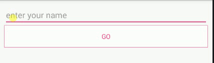

# EnableButton
There is a picture shows the result of the project.

It is very easy to achieve this.Just two point to remember:

 - Add a `TextWatcher` to the `EditText` to control when to set the Button enabled.
 - Set the drawable and textcolor for the Button when enanled and unenabled.

####but_selector

	<?xml version="1.0" encoding="utf-8"?>
	<selector xmlns:android="http://schemas.android.com/apk/res/android">
	    <item android:state_enabled="false">
	        <shape android:shape="rectangle">
	            <stroke android:width="1px" android:color="@color/colorAccent" />
	            <solid android:color="@android:color/white" />
	        </shape>
	    </item>
	    <item android:state_pressed="true">
	        <shape android:shape="rectangle">
	            <solid android:color="@android:color/darker_gray" />
	        </shape>
	    </item>
	    <item>
	        <shape android:shape="rectangle">
	            <solid android:color="@android:color/holo_red_light" />
	        </shape>
	    </item>

	</selector>

####text_selector
	<?xml version="1.0" encoding="utf-8"?>
	<selector xmlns:android="http://schemas.android.com/apk/res/android">
	    <item android:color="@color/colorAccent" android:state_enabled="false" />
	    <item android:color="@android:color/white" />
	</selector>

    
